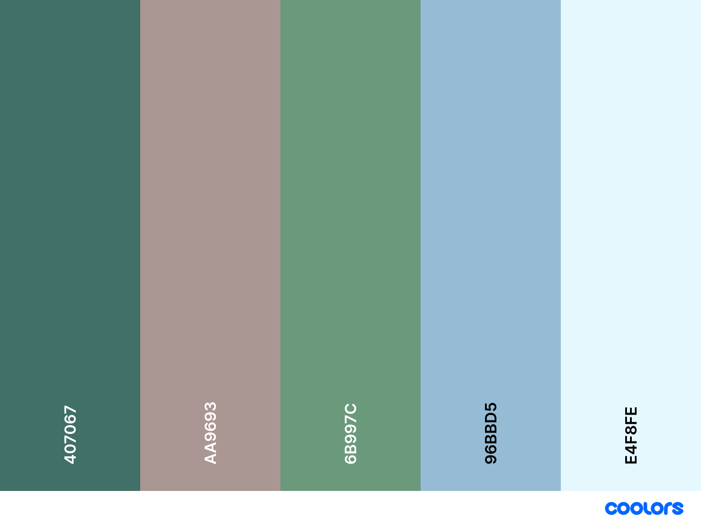

#Paldean Gym Guide
This website provides a guide for players of Pokemon Violet Scarlet on how to successfully defeat the eight gym leaders. It will be of benefit to players that are new to the Pokemon universe that are not fully versed in the type match ups in the pokemon universe as the weaknessess and resistances of each pokemon used is discussed on the site. In addition to this recommended pokemon to use for each gym are included in the tips section.
##User experience
-###User Stories
-####First time visitor goals
1. I want to gain insight into defeating the gym leaders of the Pokemon generation 9 games Violet and Scarlet.
2. I want to ensure the author of the site is a trusted source and is knowledgeable about the pokemon universe.
3. I want to be able to navigate the site with ease and have the option to ask questions to the author.
####Returning Visitor goals
1. I want to take note of the pokemon listed in the tips section on who the author recommended for each gym leader.
2. I want to visit the gallery and see the images taken by the author throughout the game.
3. I want to check any social media links listed to see other sites and pages the author may have.
####Frequent user Goals
1. I want to check in to see if any additional content has been added for guides on how to defeat the titan pokemon and team star bases.
2. I want to contact the author with questions and feedback on how their recommended worked.
3. I want to check the links to see are there any more blogs posts on the linked social media accounts.
####Owner goals
1. To develop an online presence
2. To demonstrate knowledge of the Pokemon universe.
3. To contribute positively to the vast online Pokemon community.
##Design Features
###Color Scheme

The main colors chosen are Tuscany, Hookers Green.