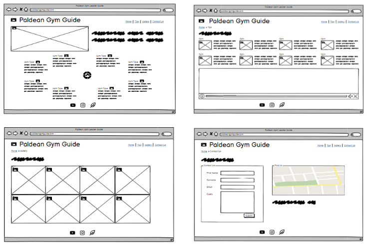

# Paldean Gym Guide

This website provides a guide for players of Pokémon Violet and Pokémon Scarlet on how to successfully defeat the eight gym leaders. It will be of benefit and value to players that are new to the Pokémon universe that are not fully versed in the type matchups as the weaknessess of each gym leaders' Pokémon are discussed on the site. In addition to this recommended Pokémon to use for each gym are included in the tips section to further assist players in their endeavour. 

[View the live website here](https://louiseconlon11.github.io/paldean-gym-guide/)

## User experience

### User Stories

- #### First Time Visitor Goals

1. I want to gain insight into defeating the gym leaders of the Pokémon generation 9 games Violet and Scarlet.
2. I want to ensure the author of the site is a trusted source and is knowledgeable about the Pokémon universe.
3. I want to be able to navigate the site with ease.

- #### Returning Visitor Goals

1. I want to read about the Pokémon listed in the tips section on which the author recommends for each gym leader.
2. I want to visit the Gallery page and see the images taken by the author throughout their journey in the Paldean landscape.
3. I want to check any social media links included to see other sites and pages the author has.

- #### Frequent User Goals

1. I want to check in to see if any additional content has been added for guides on how to defeat the Titan Pokémon and the Team Star bases.
2. I want to contact the author with questions and feedback on their recommendations using the Contact Us page.
3. I want to check the social media links to see are there any updated blog posts regarding timelines for planned future implemented features for the site.

- #### Owner goals

1. To contribute positively to the vast and passionate online Pokémon community.
2. To demonstrate extensive knowledge of the Pokémon universe.
3. To develop an online presence.

### Design

#### Color Scheme

The main colors used are Russian Green, Shiny Shamrock, Eggshell and Deep Taupe. The color scheme was chosen by uploading the hero image to the [coolors](https://coolors.co) website and choosing a selection of the colors identified in the image.

#### Typography

I used [Fontjoy](https://fontjoy.com) to choose a pairing of fonts and [Googlefonts](https://googlefonts.com) for the import link. The fonts chosen are Arima Madurai for the body and Fanwood Text for the headings. I used sans-serif as the backup text font for accessibility.

#### Imagery

All images included in the website have been taken by the author from the Nintendo Switch Pokémon Violet and Scarlet games. The hero image chosen is that of a landscape in the game the player encounters early on with the Academy in the center of the image and the lush greens and browns of the beautiful nature of Paldea at the forefront. I chose this image as the hero image as I believe it is a very aesthetically pleasing for the user and evokes a positive emotive response from the user.

### Wireframes

- Desktop wireframe -[View](https://balsamiq.cloud/s3dzpum/pq4i5x0/bmpr)

- Mobile wireframe - [View](https://balsamiq.cloud/s3dzpum/poifz5k/bmpr)

- Tablet wireframe - [View](https://balsamiq.cloud/s3dzpum/p2iwu7m/bmpr)

## Existing features

- Navigation bar on each of the pages to allow the user to navigate with ease. This avoids the use of any back buttons and allows for a more user friendly site.

- Website logo and image of the Paldean map on the top left corner of each page which upon clicking returns the user to the home page to aid with the navigation features.

- The hero image is aesthetically pleasing with the main aim of the site overlayed on the image to grab the users attention immediately. Players of the generation 9 games will recognise the Academy in the hero image instantly.

[View](https://louiseconlon11.github.io/paldean-gym-guide/index.html)

- The Home page section guide on the gym leaders clickable from all pages with information for the user on how to successfully defeat all gyms leaders. This provides the user with information on the weaknesses of each gym leader and allows the user to act accordingly based on the information given.

- There is a gym type section under the gym leader guide with images of each of the eight gym leader types which gives the user insight into the Pokémon types the gym leaders use and to plan their team accordingly.

- The Footer section contains social media links which are clickable and allow access to sites that provide additional information for the user about the Pokémon universe such as [Bulbapedia](https://bulbapedia.bulbagarden.net/wiki/Main_Page) and information about the author with instagram and youtube links.

- The Recommended Pokémon section on the Tips page encourages the user to use a variety of Pokémon in addition to type match up strategies in order to gain success in the Paldean gym challenge.

- The Tips page also contains an embedded youtube video, created by the author, showing the author successfully defeating the ghost gym leader. Two of the recommended Pokémon are visible in the 30 second clip which provides users that are playing the game with a strategy for this battle and evokes excitement and enthusiasm for prospective players as the new form of mega evolution known as terastallizing is recorded in this clip.

[View](https://louiseconlon11.github.io/paldean-gym-guide/tips.html)

- A gallery page for the user to experience some of the adventures the author had while playing the game and exploring Paldea. This provides value to the user as they can compare and contrast their own experiences while adventuring through Paldea or spark interest in those users hoping to play.

[View](https://louiseconlon11.github.io/paldean-gym-guide/gallery.html)

- A Contact Us page for players to contact the author with specific questions about the games or with feedback and user experiences of the site. 
The value for the action attribute used for this website is the address given used during the [Form Code Institute Tutorial](https://learn.codeinstitute.net/courses/course-v1:CodeInstitute+HE101+2020/courseware/fcc67a894619420399970ae84fc4802f/54c8bc3847e243f1ab8d0e5ccc1cc97a/?child=last)

The address shown in the iframe on the contact us page is the Code Institute address is Dublin snipped from [Google Maps](https://www.google.com/maps/place/Code+Institute/@53.2982013,-6.1808393,17z/data=!3m1!4b1!4m5!3m4!1s0x48670e99733f3617:0x7ff7202fe3dea603!8m2!3d53.2981981!4d-6.1786506)

- The contact us page includes a recommendation from the author for the user which encourages users and players to diversify their teams and experiment with many different variety of Pokémon to learn more about the universe and enhance their enjoyment and understanding.

[View](https://louiseconlon11.github.io/paldean-gym-guide/contact-us.html)

- A fully responsive site that can be navigated with ease on desktop, laptop and mobile devices.

## Acessibility
- Using the semantic header, section and footer elements to aid screen readers.
- Including aria labels for the social media clickable links.
- Using alt attributes for all image elements used.
- Using a specific palette of colors that allow clear contrast for users.
- Using contrasting colors on the contact form when the user hovers over the input field.
- Using sans-serif fonts as back-up fonts.

## Languages
[HTML5](https://en.wikipedia.org/wiki/HTML5)
[CSS3](https://en.wikipedia.org/wiki/CSS)

## Framesworks, Libraries and Programs

1. [Coolors](https://coolors.co)
- Coolors was used to upload the hero image and choose a design palette for the website based on the colors in the chosen hero image.
2. [Fontjoy](https://fontjoy.com)
- Fontjoy was used to choose a font pairing.
3. [Google Fonts](https://googlefonts.com)
- Googlefonts was used to access the import link for the chosen fonts.
4. [Font Awesome](https://fontawesome.com)
- Font Awesome was used to choose icons and use the html code displayed to insert the chosen icons into the footer and contact us sections of the site. There was no icon for [Bulbapedia](https://bulbapedia.bulbagarden.net/wiki/Main_Page) so I used the green leaf icon available as a substitute.
5. [Balsamiq](https://balsamiq.com)
- Balsamiq was used for designing the wireframes for desktop, tablet and smart phone screen sizes.
6. [Git](https://gitpod.io)
- Gitpod was used for adding commits each time a new feature was added to the website and for pushing the commits to Github.
7. [Github](https://github.com)
- Github was used for storing the site after being pushed from gitpod and for deploying the website.
8. [Youtube](https://youtube.com)
- Youtube was used to upload the video recorded on the Nintendo Switch and then embed into the website so Youtube can host the video to improve performance.
9. [Google maps](https://www.google.com/maps)
- Google maps was used for the address of the Code Institute building in Dublin and a screenshot of the address was used in the iframe element on the contact us page.
10. The Nintendo Switch gaming console and the Game Freak Pokémon Violet and Scarlet video games to take and record the images and video files used throughout the website.

## Future Features

Pokémon Violet and Pokémon Scarlet are very expansive open world games with endless possibilities on the route to take and the areas to explore. I have chosen to focus on one of the possible routes a player can take however there are many more other challenges in store for the player throughout the world of Paldea. 
- In future I would like to include sections with information on battlng the five Titans and the five Team Star leaders. 
- I would like to include a section on the new Pokémon that have been introduced in generation 9 with users having the facility to vote for their new favourite Pokémon.
- To implement a quiz for users to particpate in with questions regarding the games and the new generation Pokémon.

### Validation & Testing

#### First Validation

[W3C HTML Validator](https://validator.w3.org/#validate_by_input)
- No errors were found when the html code for the home page was passed through the official html validator.

- There were errors on the tips, gallery and contact us html code as a width attribute with a % unit of measurement was used.
- On the contact us page width and height attributes with the px unit of measurement were included in the iframe element.

[W3C CSS Validator (Jigsaw)](https://jigsaw.w3.org/css-validator/#validate_by_input)
- No errors were found when the css code was passed through the official validator.
- Four warnings were recorded, three regarding the necessity to input "" around the font styles and one warning regarding the google fonts imported file.

#### Final Validation
- No errors were found for the index.html, tips.html and the contact-us.html files.
- Error recorded on gallery.html for not including a heading within the section.

- No errors on the css validator. The warning regarding the imported file still appears.

### Testing User Stories
#### First time users
1. The users found the content easy to read and understand and recommended the site is kept simple and not overloaded with too much detail.
2. The users confirmed the weaknesses listed were accurate for the Pokémon universe and confirmed the site was from a credible source.
3. Users found the site easy to navigate and all links, both internal and external, worked.

### Testing on Browers and Devices

#### Browser Testing
The website was tested on Google Chrome, Internet Explorer and Microsoft Edge.

- The layout and positioning on all three applications appear consistent.
- The internal and external links all work. The external links open in a new tab.
- The form on the contact us page accepts input and will not allow the user to submit unless a name and email are given and the email requires the @.
- The website is responsive on all applications.
- The linked youtube video plays in all applications.

#### Device Testing
The website was tested on a variety of devices including desktop, HP laptops, Samsung Galaxy and iPhone 13 devices.
Family members were asked to check the website on their devices and highlight any issues with overlap, images loading or links.

#### Lighthouse Testing
I carried out a lighthouse report using the Google Chrome Lighthouse function for desktop and mobile. The results returned are very positive for accessibility, best practices, search engine optimisation and excellent performance on desktop view and very good on mobile.

### Bugs

#### Unfixed bugs

- When testing on the html validator for the gallery.html file an error returned recommending to use h2-h6 elements inside the section or to use a div element.
- I wrapped the image elements in a div container inside the section element however the error message still appears.

#### Solved bugs
- When testing the deployed website for responsivity, on larger desktop screen sizes, the hero image cover text was appearing very far right of the image. Fixed this position issue for desktop screens with media queries targetting screens larger than 1300px and 1400px.

- After the first deployment of the site the following actions needed to be taken:
1. The bulbapedia link was listed as .com, its the .net site that required linking to, which has been fixed on all four pages.
2. There was a large vertical gap on the contact us page between the navigation bar and the contact section, this was fixed by removing the height property given.
3. Family members tested the site on a variety of android and iphone devices, there was more overlap on the iPhone13 model on the home page screen than the Samsung devices so I included additional media queries to target smaller screen sizes to account for this. 

## Deployment

Github was used to deploy the site.
### Instructions
1. Login to github.com
2. Click the project title under the list of repositories.
3. Click on the settings option.
4. Click on pages on the left hand side under the code and automation heading.
5. Under the heading of build and deployment click the branch drop down menu and select main and click save.
6. Refresh the page and a notification will display that your site is now live and click the visit site option.

The live link to the website can be found [here](https://louiseconlon11.github.io/paldean-gym-guide/)

## Credits

### Code
- The love running code layout for arranging the navigation layout and social media layout was used in designing my own header navigation elements and footer external links.
[view](https://learn.codeinstitute.net/courses/course-v1:CodeInstitute+LR101+2021_T1/courseware/4a07c57382724cfda5834497317f24d5/637be1a2e3b84b25aa33f3ab4d98603c/)
- The [Love Running](https://learn.codeinstitute.net/courses/course-v1:CodeInstitute+LR101+2021_T1/courseware/4a07c57382724cfda5834497317f24d5/12ba169db7b34b82b137edd825af6a02/) design for the club ethos section inspired the 33% division of my gym section on the home page.
- A youtube video file, on how to use the display flex property was used to understand how to include this property in the website. The site is no longer live on youtube but I have attached a screenshot of the video file.

- The sample readme files for the love running project and the code institute page were used to help with headings and layout for the readme file for the website.
[View Love Running](https://github.com/Code-Institute-Solutions/readme-template/blob/master/README.md)
[View Code Institute](https://github.com/Code-Institute-Solutions/SampleREADME)

### Content

- All content was written by the developer.
- The icons in the footer and on the contact us page were taken from [Font Awesome](https://fontawesome.com)

### Media
- All images were taken by the developer using the screenshot feature on the Nintendo Switch while playing the Game Freak Pokémon Violet and Scarlet games.

### Acknowledgements

- Thank you to my partner and family for checking and using the website on their phones and letting me know of any overlap and gap issues on the different devices.
- Thank you to my mentor for feedback and support on planning and completing the project.
- Thank you to the facilitator for including useful video links on how to use Balsamiq and how to write a good README file.
